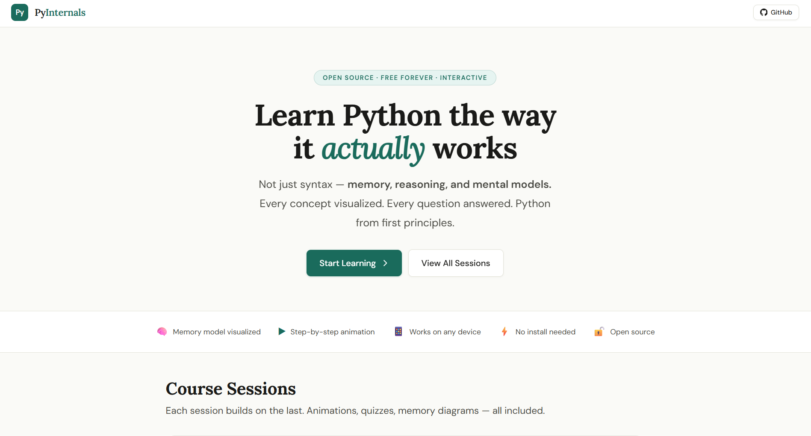
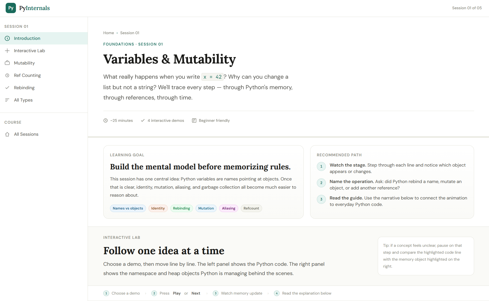

<div align="center">


<br /><br />

# 🐍 Py Internals: Learn Python from the Inside Out

**An open-source, interactive Python course that shows you what Python is *actually* doing**

[**View the Course →**](https://inboxpraveen.github.io/Py-Internals) &nbsp;·&nbsp;
[**Session 01: Variables**](https://inboxpraveen.github.io/Py-Internals/sessions/01-variables/) &nbsp;·&nbsp;
[**Session 02: Functions**](https://inboxpraveen.github.io/Py-Internals/sessions/02-functions/) &nbsp;·&nbsp;
[**Session 03: Lists & Dicts**](https://inboxpraveen.github.io/Py-Internals/sessions/03-lists-dicts/) &nbsp;·&nbsp;
[**Session 04: Classes**](https://inboxpraveen.github.io/Py-Internals/sessions/04-classes/) &nbsp;·&nbsp;
[**Session 05: Iterators**](https://inboxpraveen.github.io/Py-Internals/sessions/05-iterators/) &nbsp;·&nbsp;
[**Session 06: Decorators**](https://inboxpraveen.github.io/Py-Internals/sessions/06-decorators/) &nbsp;·&nbsp;
[**Session 07: The GIL**](https://inboxpraveen.github.io/Py-Internals/sessions/07-gil/) &nbsp;·&nbsp;
[**Session 08: Exceptions**](https://inboxpraveen.github.io/Py-Internals/sessions/08-exceptions/) &nbsp;·&nbsp;
[**Glossary**](https://inboxpraveen.github.io/Py-Internals/glossary.html) &nbsp;·&nbsp;
[**Report a Bug**](https://github.com/inboxpraveen/Py-Internals/issues) &nbsp;·&nbsp;
[**Request a Topic**](https://github.com/inboxpraveen/Py-Internals/discussions)

<br />


</div>

---

## What is this?

Most Python tutorials teach you *what* to type. Py Internals teaches you *what Python does with it.*

When you write `x = 42`, Python doesn't "store 42 in x". It creates an integer **object** on the heap, then binds the name `x` to it in the current namespace. When you write `x = 100`, the old `42` object doesn't disappear on the spot. It waits until its reference count hits zero, then gets garbage collected.

This course makes all of that **visible**. Every concept is paired with an animated memory diagram that shows stack frames, heap objects, reference counts and garbage collection, step by step, at your own pace.

---

## Why this exists

> "I know *how* to use Python. I don't know *why* it works this way."

That gap, between using a tool and understanding it, is where bugs hide. It's why `a = b; b.append(1)` surprises you. It's why passing a list to a function sometimes mutates the original and sometimes doesn't. It's why your "optimisation" did nothing.

Py Internals closes that gap, visually, and for free.

---

## Features

- 🎞️ **Step-by-step animations**: walk through code execution one step at a time, or let it autoplay
- 🧠 **Real memory diagrams**: see the heap, stack frames, reference counts and GC cycles
- 🔒 **Runtime state, too**: Session 07 draws the interpreter itself, so you can watch the GIL change hands
- 🧨 **Exceptions in flight**: Session 08 draws a frame being torn down and the traceback growing as an exception climbs the stack
- 🔬 **Type explorer**: the nine types you meet first, their mutability, and how each behaves in memory
- ✅ **Check-your-understanding quizzes**: predict the memory, then see why
- 📚 **Glossary**: plain-English definitions you can search mid-lesson
- ⌨️ **Keyboard playback**: `→` `←` Space `R` to step the lab
- 📖 **Narrative articles**: each session pairs the visual with a clear written explanation
- 📱 **Fully responsive**: reads well on a phone, animates nicely on a desktop
- ⚡ **No login, no account, no tracking**: just open it and learn
- 💾 **Progress saved locally**: your completed sessions are remembered in `localStorage`
- 🌐 **Nothing to install**: pure static files, and after the first load only the web fonts need the network

---

## Course content

| # | Session | Status | Concepts |
|---|---------|--------|----------|
| 01 | [Variables & Mutability](https://inboxpraveen.github.io/Py-Internals/sessions/01-variables/) | ✅ Live | Names vs objects, rebinding, aliasing, mutation, GC |
| 02 | [Functions & Scope](https://inboxpraveen.github.io/Py-Internals/sessions/02-functions/) | ✅ Live | Call stack, frames, LEGB, closures, mutable defaults |
| 03 | [Lists, Dicts & References](https://inboxpraveen.github.io/Py-Internals/sessions/03-lists-dicts/) | ✅ Live | Aliasing, shallow copy, deep copy, nested mutation |
| 04 | [Classes & Objects](https://inboxpraveen.github.io/Py-Internals/sessions/04-classes/) | ✅ Live | `self`, `__init__`, `__dict__`, class vs instance, bound methods, MRO |
| 05 | [Iterators & Generators](https://inboxpraveen.github.io/Py-Internals/sessions/05-iterators/) | ✅ Live | `iter` / `next`, `yield`, suspended frames, lazy vs eager |
| 06 | [Decorators](https://inboxpraveen.github.io/Py-Internals/sessions/06-decorators/) | ✅ Live | `f = deco(f)`, wrappers, closure cells, `functools.wraps`, stacking |
| 07 | [The GIL & Concurrency](https://inboxpraveen.github.io/Py-Internals/sessions/07-gil/) | ✅ Live | GIL, races, `Lock`, I/O vs CPU, `multiprocessing`, `asyncio`, free threading |
| 08 | [Exceptions, Tracebacks & Context Managers](https://inboxpraveen.github.io/Py-Internals/sessions/08-exceptions/) | ✅ Live | `raise`, stack unwinding, tracebacks, `try` / `except` / `finally`, `with`, `__enter__` / `__exit__`, `raise from` |

---

## Project structure

```
Py-Internals/
├── index.html                   ← Course homepage & session grid
├── LICENSE                      ← Py Internals Community License v1.0
├── README.md                    ← This file
├── IMPLEMENTATION_GUIDE.md      ← How to build new sessions
│
├── assets/
│   ├── css/
│   │   ├── base.css             ← Design tokens, reset, typography
│   │   ├── layout.css           ← App shell, sidebar, stage, hero, narrative
│   │   ├── components.css       ← Buttons, badges, callouts, type chips
│   │   ├── memory-viz.css       ← Stack frames, heap objects, reference arrows
│   │   ├── animations.css       ← All keyframes and transition utilities
│   │   └── session.css          ← Shared session layout, quizzes, legends
│   │
│   └── js/
│       ├── core.js              ← App init, sidebar, progress, quizzes (PJ.Core)
│       ├── animator.js          ← Play/pause/step engine (PJ.Animator)
│       ├── memory-viz.js        ← Memory snapshot renderer (PJ.MemoryViz)
│       └── syntax.js            ← Python syntax highlighter (PJ.Syntax)
│
├── glossary.html                ← Searchable term list
├── 404.html                     ← Not-found page with every session linked
├── robots.txt, sitemap.xml, feed.xml, llms.txt, llms-full.txt, manifest.webmanifest
├── tools/build_seo.py           ← Regenerates all of the above plus each page's head tags and share card
│
└── sessions/
    ├── 01-variables/            ← Names, objects, mutation, GC
    ├── 02-functions/            ← Frames, LEGB, closures, defaults
    ├── 03-lists-dicts/          ← Aliases, shallow/deep copy
    ├── 04-classes/              ← self, __dict__, bound methods
    ├── 05-iterators/            ← iter/next, yield, lazy evaluation
    ├── 06-decorators/           ← f = deco(f), wrappers, functools.wraps
    ├── 07-gil/                  ← the interpreter lock, races, processes, asyncio
    └── 08-exceptions/           ← raise, unwinding, tracebacks, finally, with
```

---

## Running locally

No build tools. No npm install. No webpack. Just:

```bash
git clone https://github.com/inboxpraveen/Py-Internals.git
cd Py-Internals

# Option 1: Python (most systems)
python -m http.server 8000

# Option 2: Node
npx serve .

# Option 3: VS Code
# Install the "Live Server" extension, right-click index.html → Open with Live Server
```

Then open [http://localhost:8000](http://localhost:8000).

> **Why a server?** Opening the files straight from disk mostly works, but a
> local server keeps the root-relative paths, the browser cache and the
> `localStorage` origin behaving the way they will in production. It's one
> command and it saves some confusing surprises.

---

## Application Screenshot





---

## Contributing

Contributions are very welcome, especially new sessions.

### Adding a session

1. Read [`IMPLEMENTATION_GUIDE.md`](IMPLEMENTATION_GUIDE.md). It covers everything
2. Copy `sessions/06-decorators/` as a starting point, since it's the leanest complete shell. Read `sessions/07-gil/` for the widest range of components and `sessions/08-exceptions/` for frames being torn down
3. Create your demo steps in `session.js` following the memory snapshot format
4. Add the session to `PAGES` in `tools/build_seo.py` and run `python tools/build_seo.py`. That regenerates the page's head tags, its share card, the sitemap, the feed and `llms.txt`
5. Submit a PR against `main`

### Good first issues

- 🐛 Fix a typo or explanation in an existing session
- 🎨 Improve mobile layout for a specific component
- 📝 Add a callout or tip to an existing narrative section
- ✨ Propose a new session topic in [Discussions](https://github.com/inboxpraveen/Py-Internals/discussions)

### Standards

- All new sessions must follow the step design rules in the implementation guide (first step = empty state, last step = summary, one concept per step)
- CSS changes must use the existing design token system, with no hardcoded hex values
- JS changes must not introduce external dependencies

---

## Finding the course

Everything a search engine, a social network or a language model needs is generated into the repo by `tools/build_seo.py`, so the site stays plain static files:

- every page has a canonical URL, a description, Open Graph and Twitter tags, and JSON-LD (`Course` on the homepage, `Article` + `LearningResource` with breadcrumbs on each session, `DefinedTermSet` on the glossary)
- a share card per page in `assets/images/og/`
- `sitemap.xml`, `robots.txt`, an Atom `feed.xml`, and a web app manifest
- [`llms.txt`](https://inboxpraveen.github.io/Py-Internals/llms.txt) and [`llms-full.txt`](https://inboxpraveen.github.io/Py-Internals/llms-full.txt), the whole course as Markdown for AI assistants and anyone who wants the text without the animations

## Tech stack

| Layer | Choice | Why |
|-------|--------|-----|
| Markup | Semantic HTML5 | Accessible, no framework needed |
| Styles | Vanilla CSS with custom properties | Zero runtime, full browser support |
| Scripts | Vanilla JS, plain `<script>` tags | No bundler, no modules, trivial to read and fork |
| Fonts | [Lora](https://fonts.google.com/specimen/Lora) · [DM Sans](https://fonts.google.com/specimen/DM+Sans) · [JetBrains Mono](https://fonts.google.com/specimen/JetBrains+Mono) | Editorial + readable + code-optimised |
| Hosting | GitHub Pages | Free, zero config, git-native |
| Persistence | `localStorage` | Session progress, no backend needed |

---

## Design philosophy

**Show, don't just tell.** Every concept in this course has a picture. If you can't draw a memory diagram for it, the explanation isn't done yet.

**One thing per step.** Each animation step introduces one new idea. No step ever asks you to track two changes at once.

**Beautiful enough to take seriously.** The design is deliberate: warm cream backgrounds, editorial typography, restrained colour. Learning tools don't have to look like homework.

**Zero friction to fork.** You can clone this, remove the attribution (actually, keep the attribution, it's in the license), and build your own course on top of it. The implementation guide exists so this is a 20-minute job, not a 20-hour one.

---

## License

This project is published under the **PI Community License v1.0** (Py Internals Community License). See [`LICENSE`](LICENSE) for the full text.

**Short version:**
- ✅ Free to use, share, and adapt for educational purposes
- ✅ Free to embed visuals in blog posts, talks, and notes
- 📌 Attribution required (visible credit with a link back to this repo)
- 🔁 Derivatives must use the same or a compatible license
- 🚫 No selling or paywalling without written permission

---

## Acknowledgements

Inspired by the incredible work of:

- [Python Tutor](https://pythontutor.com/) by Philip Guo, the original Python visualiser
- [CPython internals documentation](https://devguide.python.org/), the source of truth
- [Fluent Python](https://www.oreilly.com/library/view/fluent-python-2nd/9781492056348/) by Luciano Ramalho, the book that made Python's object model click

---

<div align="center">

Made with patience and obsessive attention to spacing.<br />
If this helped you, consider starring the repo ⭐. It helps others find it.

</div>
